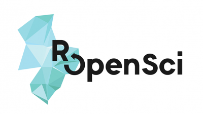

```{r, include = FALSE}
unlink(".RData")
suppressMessages(suppressWarnings(library(drake)))
suppressMessages(suppressWarnings(library(tidyverse)))
pkgconfig::set_config("drake::strings_in_dots" = "literals")
clean(destroy = TRUE, verbose = FALSE)
knitr::opts_chunk$set(collapse = TRUE)
options(warnPartialMatchArgs = FALSE)
```

## Why drake?

<br>


## Data analysis has interconnected steps.


## Each update...


## ...can invalidate other work.


## Do you hunt for all the changes yourself?
- Messy and prone to human error.
- Not reproducible.


<div style="font-size: 0.5em;"><a href="https://openclipart.org/detail/216179/messy-desk">https://openclipart.org/detail/216179/messy-desk</a></div>

## Do you rerun everything from scratch?

- Takes too long.
- Too frustrating.


<div style="font-size: 0.5em;"><a href="https://openclipart.org/detail/275842/sisyphus-overcoming-silhouette">https://openclipart.org/detail/275842/sisyphus-overcoming-silhouette</a></div>

## Example: GDP per capita

- Which quantity is a better predictor of GDP per capita, life expectancy or population?
  - [Gapminder data](https://www.gapminder.org/data/): observations on multiple countries from 1952 to 2007.
  - Bayesian regeression with [`rstanarm`](https://github.com/stan-dev/rstanarm): straightforward inference and interpretation.
- But Bayesian methods can be <span style = "color: red">**computationally expensive**</span>!

## Pipeline toolkits for large computation

- Lots of tools: [github.com/pditommaso/awesome-pipeline](https://github.com/pditommaso/awesome-pipeline).
- Few designed for R.


## GDP analysis pipeline with `drake`


## The drake plan: steps of the workflow.

```{r show_plan, eval = FALSE}
plan <- drake_plan(
  lifeExp = fit_model(covariate = "lifeExp", dataset = dataset),
  log_pop = fit_model(covariate = "log_pop", dataset = dataset),
  dataset = prepare_dataset(gapminder::gapminder),
  plots = gather_plots(lifeExp, log_pop),
  report = render(
    knitr_in("report.Rmd"),
    output_file = file_out("report.html")
  )
)
```

```{r load_plan, echo = FALSE}
plan <- drake_plan(
  lifeExp = fit_model(covariate = "lifeExp", dataset = dataset),
  log_pop = fit_model(covariate = "log_pop", dataset = dataset),
  dataset = prepare_dataset(gapminder::gapminder),
  plots = gather_plots(lifeExp, log_pop),
  report = render(
    knitr_in("report.Rmd"),
    output_file = file_out("report.html"),
    quiet = TRUE
  )
)
```

## The plan is just a data frame.

```{r showplan}
plan
```

## Support for the plan

```{r support, message = FALSE, warning = FALSE}
# Load your packages: library(drake), library(gapminder), etc.
source("packages.R")

# Define your functions: prepare_dataset(), fit_model(), etc.
source("functions.R") 
```

## Run your workflow.

```{r firstmake}
make(plan)
```

## Output file report.html


## Get targets from the cache.

```{r loadd}
readd(dataset)
```

## Find things to improve.

```{r readd, fig.width = 8, fig.height = 4}
loadd(plots)
plot(plots)
```

```{r forget}
rm(plots)
```

## Go back and change a function.

```{r changefn}
gather_plots

# Update in functions.R
# and source("functions.R") again.
gather_plots <- function(...) {
  grobs <- lapply(list(...), plot_model)
  arrangeGrob(grobs = grobs, ncol = 2)
}
```

## Which targets need an update?

```{r outdated}
config <- drake_config(plan)
outdated(config)
```

```{r revis, eval = FALSE}
vis_drake_graph(config, targets_only = TRUE)
```

## vis_drake_graph()


## Run only the parts that need to change.

```{r make-fixed}
make(plan)
```

## Life expectancy wins!

```{r good-plots, fig.width = 8, fig.height = 4}
loadd(plots)
plot(plots)
```

```{r rmplots2, echo = FALSE}
rm(plots)
```

## Reproducibilty is about confidence and trust.

```{r make-done}
make(plan)

outdated(config)
```

- `drake` gives you **tangible evidence** that your results match the code and data you have right now!

## Generate large plans

- `map_plan()`
- `reduce_plan()`
- `reduce_by()`
- `gather_plan()`
- `gather_by()`
- `evaluate_plan()`
- `expand_plan()`

## Run your targets in parallel.

```{r localparallel, eval = FALSE}
future::plan(future::multiprocess)
make(plan, jobs = 2, parallelism = "future")
```

## Distributed computing: persistent workers

```{r slurmclustermq, eval = FALSE}
drake_hpc_template_file("slurm_clustermq.tmpl") # Modify by hand.
options(
  clustermq.scheduler = "slurm",
  clustermq.template = "slurm_clustermq.tmpl"
)
make(plan, jobs = 2, parallelism = "clustermq")
```

## Distributed computing: persistent workers

<script src="https://fast.wistia.com/embed/medias/ycczhxwkjw.jsonp" async></script><script src="https://fast.wistia.com/assets/external/E-v1.js" async></script><div class="wistia_responsive_padding" style="padding:56.21% 0 0 0;position:relative;"><div class="wistia_responsive_wrapper" style="height:100%;left:0;position:absolute;top:0;width:100%;"><div class="wistia_embed wistia_async_ycczhxwkjw videoFoam=true" style="height:100%;position:relative;width:100%"><div class="wistia_swatch" style="height:100%;left:0;opacity:0;overflow:hidden;position:absolute;top:0;transition:opacity 200ms;width:100%;"></div></div></div></div>

## Distributed computing: transient workers

```{r slurmfuture, eval = FALSE}
library(future.batchtools)
drake_hpc_template_file("slurm_batchtools.tmpl") # Modify by hand.
future::plan(batchtools_slurm, template = "slurm_batchtools.tmpl")
make(plan, jobs = 2, parallelism = "future")
```

## Distributed computing: transient workers

<script src="https://fast.wistia.com/embed/medias/340yvlp515.jsonp" async></script><script src="https://fast.wistia.com/assets/external/E-v1.js" async></script><div class="wistia_responsive_padding" style="padding:56.21% 0 0 0;position:relative;"><div class="wistia_responsive_wrapper" style="height:100%;left:0;position:absolute;top:0;width:100%;"><div class="wistia_embed wistia_async_340yvlp515 videoFoam=true" style="height:100%;position:relative;width:100%"><div class="wistia_swatch" style="height:100%;left:0;opacity:0;overflow:hidden;position:absolute;top:0;transition:opacity 200ms;width:100%;"></div></div></div></div><br>

## Get drake and get help.

```{r install, eval = FALSE}
install.packages("drake") # CRAN release

library(devtools)
install_github("ropensci/drake") # Development version

library(drake)
drake_example("gapminder") # Download today's code.
```

- [These slides](https://wlandau.github.io/drake-datafest-2019) ([source](https://github.com/wlandau/drake-datafest-2019))
- [Quick reference guide](https://ropensci.github.io/drake/)
- [Technical manual and tutorials](https://ropenscilabs.github.io/drake-manual/)
- [File an issue.](https://github.com/ropensci/drake/issues)
- [Contribute code.](https://github.com/ropensci/drake/pulls)
- [Discuss at rOpenSci.](https://discuss.ropensci.org/)

## Thanks

<ul style = "float: left: width: 49%">

<li><a href = "https://github.com/maelle">Maëlle Salmon</a></li>
<li><a href = "https://github.com/benmarwick">Ben Marwick</a></li>
<li><a href = "https://github.com/jules32">Julia Lowndes</a></li>
<li><a href = "https://github.com/gothub">Peter Slaughter</a></li>
<li><a href = "https://github.com/jennybc">Jenny Bryan</a></li>
<li><a href = "https://github.com/richfitz">Rich FitzJohn</a></li>
<li><a href = "https://github.com/stefaniebutland">Stefanie Butland</a></li>
</ul>
<ul style = "float: right; width: 49%">
<li><a href = "https://github.com/jarad">Jarad Niemi</a></li>
<li><a href = "https://github.com/krlmlr">Kirill Müller</a></li>
<li><a href = "https://github.com/kendonB">Kendon Bell</a></li>
<li><a href = "https://github.com/AlexAxthelm">Alex Axthelm</a></li>
<li><a href = "https://github.com/dapperjapper">Jasper Clarkberg</a></li>
<li><a href = "https://github.com/HenrikBengtsson">Henrik Bengtsson</a></li>
<li><a href = "https://github.com/thercast">Eric Nantz</a></li>
<li><a href = "https://github.com/IanAWatson">Ian Watson</a></li>
<li><a href = "https://github.com/dfalster">Daniel Falster</a></li>
<li><a href = "https://github.com/mrchypark">Chan-Yub Park</a></li>
<li><a href = "https://github.com/tiernanmartin">Tiernan Martin</a></li>
</ul>

## References

- [`drake`](https://github.com/ropensci/drake)
- [rOpenSci](https://ropensci.org)
- [Gapminder](https://www.gapminder.org) and the [`gapminder` package](https://github.com/jennybc/gapminder)
- [List of pipeline toolkits](https://github.com/pditommaso/awesome-pipeline)
- Images ([desk](https://openclipart.org/detail/216179/messy-desk), [Sisyphus](https://openclipart.org/detail/275842/sisyphus-overcoming-silhouette)) taken from from [openclipart.org](https://openclipart.org) under [CC0 1.0](https://creativecommons.org/publicdomain/zero/1.0/), [unlimited commercial use](https://openclipart.org/unlimited-commercial-use-clipart).
- The embedded parallel computing animations were created using [PowToon](https://www.powtoon.com) and are used only as explicitly permitted in the [Terms and Conditions of Use](https://www.powtoon.com/terms-and-conditions/). The maintainers of and contributors to `drake` make no copyright claim to any of the constituent graphicical elements that comprise the animations.

```{r cleanup, include = FALSE}
clean(destroy = TRUE)
```
